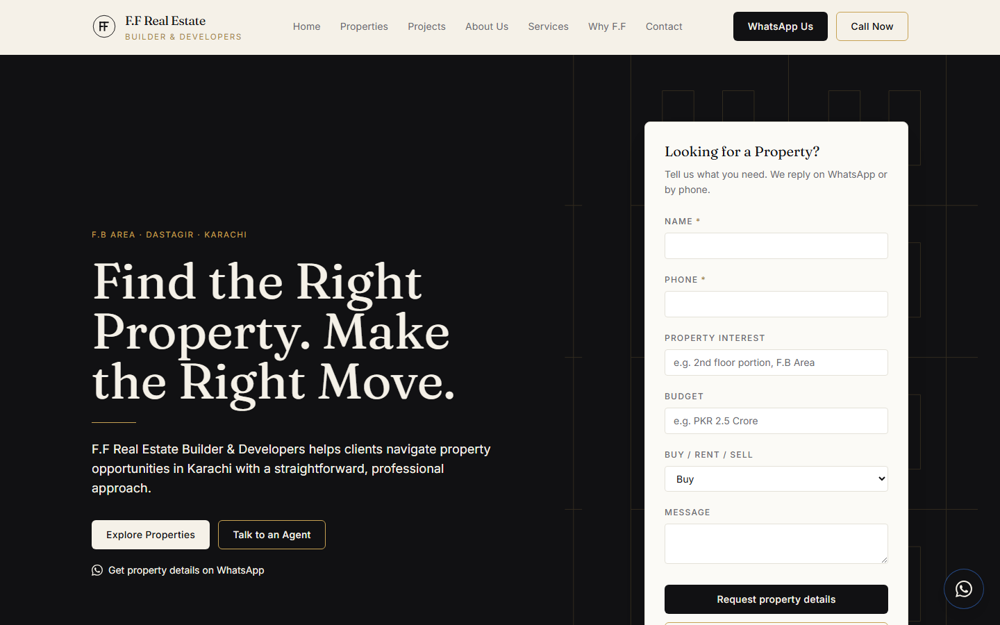
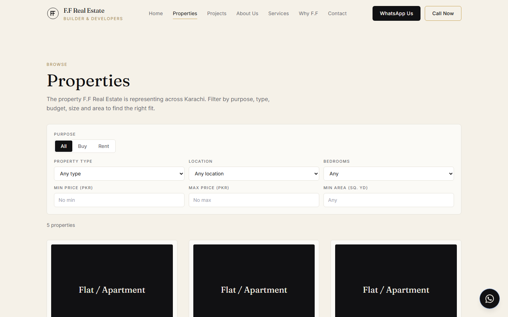
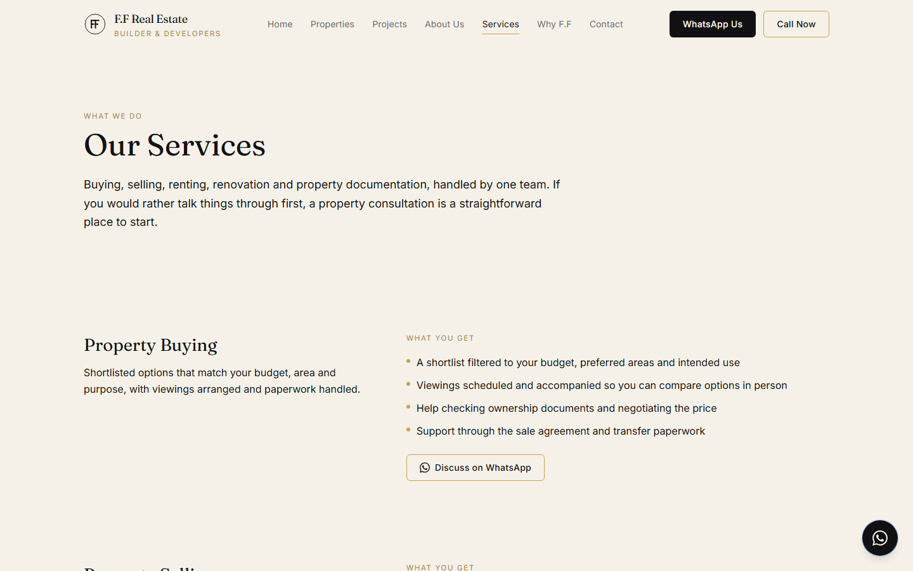
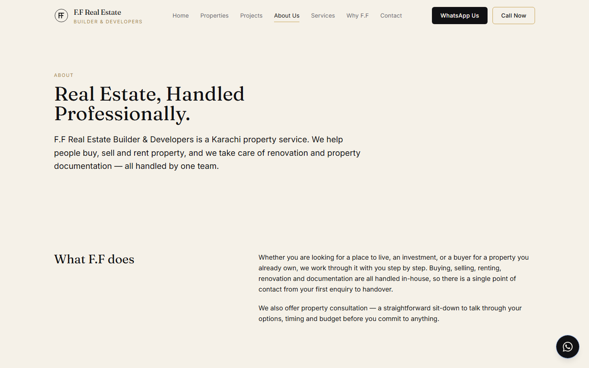
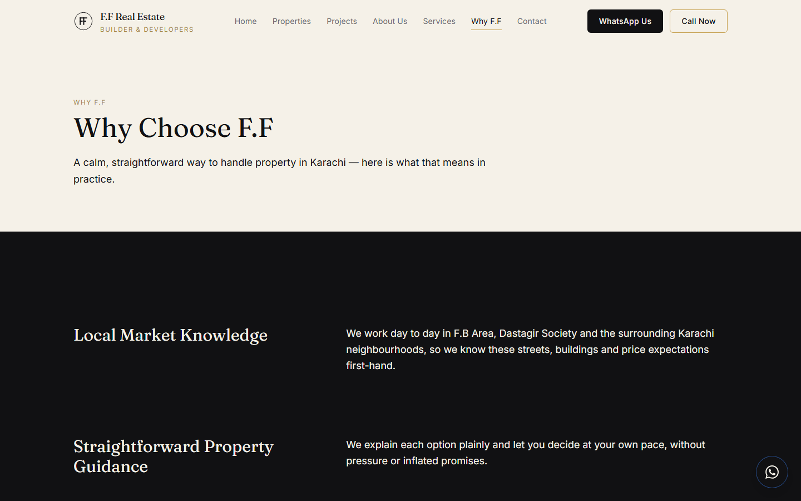
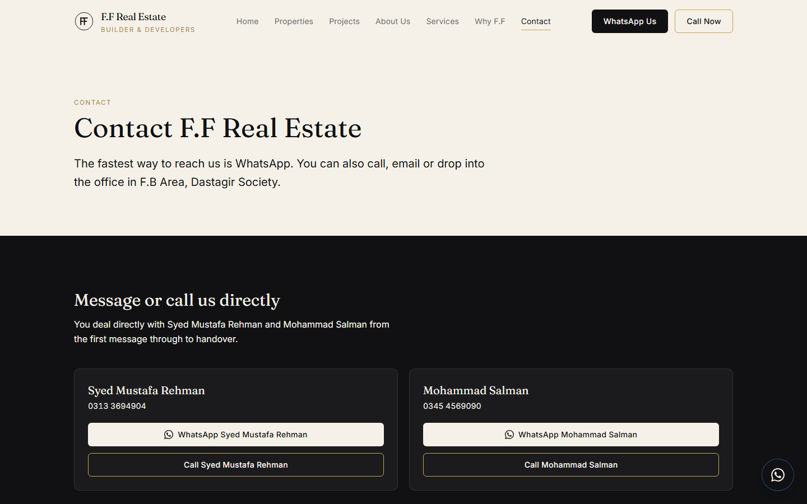
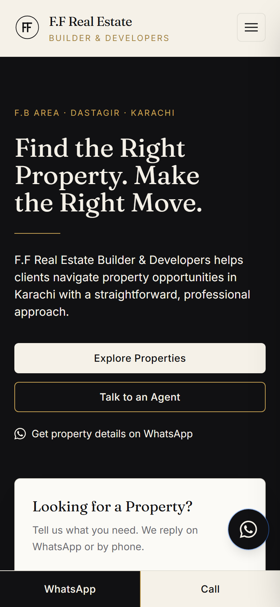

# F.F Real Estate Builder & Developers — Website

Marketing and lead-generation website for F.F Real Estate Builder & Developers —
a Karachi property firm handling buying, selling, renting, renovation and
documentation in F.B Area, Dastagir Society and the surrounding neighbourhoods.

**Live:** https://ff-real-estate-website.vercel.app



## What it does

- **Turns searches into conversations.** Every page routes the visitor to the
  same two actions — message on WhatsApp or call — with a lead form on the home
  page that emails the agents and records the enquiry.
- **A filterable property listing** — browse by purpose (buy/rent), type,
  location, bedrooms, price and size, with a dedicated page per property.
- **Full service and company pages** — buying, selling, rentals, renovation,
  documentation and consultation, plus about, "why F.F", projects and a gallery.
- **Client-editable** — an embedded Sanity Studio at `/studio` lets F.F add
  properties, projects and photos with no code and no separate login system.
- **Built for Google** — per-page metadata, Open Graph, and JSON-LD structured
  data for the business and each listing.
- **Fast and responsive** — server-rendered, image-optimised, and designed
  mobile-first with a sticky call/WhatsApp bar on phones.

## Screenshots

| Property listing | Property services |
| --- | --- |
|  |  |

| About | Why F.F |
| --- | --- |
|  |  |

| Contact | Mobile |
| --- | --- |
|  |  |

## Tech

Built with **Next.js 15 (App Router)** and an **embedded Sanity CMS** (Sanity
Studio mounted at `/studio` inside the same app), styled with Tailwind CSS v3,
tested with Vitest, deployed on Vercel.

> **Going live or handing this to the client? Read [`SETUP.md`](SETUP.md).**
> It covers the Sanity project, Vercel deploy, Gmail for lead emails, and a
> plain-language guide to the content editor.

## Key commands

| Command | Purpose |
| --- | --- |
| `npm install --legacy-peer-deps` | Install dependencies (flag required — see below) |
| `npm run dev` | Start the local dev server on http://localhost:3000 |
| `npm test` | Run the Vitest test suite once |
| `npm run test:watch` | Run Vitest in watch mode |
| `npm run typecheck` | Type-check with `tsc --noEmit` |
| `npm run build` | Production build (type-checks and prerenders) |
| `npm run seed` | Seed the Sanity dataset with site settings + contacts |
| `npm run seed:listings` | Seed the four draft property listings (run `seed` first) |

The site runs with **no Sanity project configured** — every route renders using
built-in fallback content and "coming soon" states. Add a project (see
`SETUP.md`) to manage real content.

## Local development

This project folder name contains an `&` (`F&F REAL ESTATE`). npm runs `npm`
scripts through the platform shell, and on Windows cmd.exe / PowerShell treat `&`
as a command separator, which breaks the path and makes every `npm` script fail.
To work around this, `.npmrc` sets `script-shell=bash`, so **a bash shell must be
on your PATH** to run `npm` scripts in this folder. On Windows, install
[Git for Windows](https://git-scm.com/download/win) — it ships Git Bash — and
ensure it is on PATH. macOS/Linux already have bash; the deploy target
(Vercel/Linux) is unaffected. Moving the project to a folder without an `&` in
the name removes the constraint entirely.

Dependency installs require the `--legacy-peer-deps` flag due to a transitive
peer-dependency mismatch in the Sanity toolchain:

```bash
npm install --legacy-peer-deps
```

## Environment

Copy `.env.example` to `.env.local` and fill it in. Each variable is documented
in that file and in `SETUP.md`. Without `NEXT_PUBLIC_SANITY_PROJECT_ID` the
site uses fallback content; without `SANITY_API_WRITE_TOKEN` the contact form
accepts submissions but cannot persist them.

## Project layout

| Path | What's there |
| --- | --- |
| `src/app/(site)/` | Public pages (home, properties, projects, news, gallery, about, services, why-ff, contact) |
| `src/app/studio/` | Embedded Sanity Studio at `/studio` |
| `src/app/api/lead/` | Contact-form endpoint — saves a lead, emails a notification |
| `src/sanity/schemaTypes/` | Content models (property, project, newsPost, galleryImage, siteSettings, lead, agent, service, testimonial) |
| `src/lib/` | Formatting, filters, WhatsApp links, metadata/JSON-LD, lead validation |
| `src/components/` | UI — layout, property, gallery, motion, SEO |
| `scripts/` | `seed.ts`, `seed-listings.ts` |
| `docs/CONTENT-TO-VERIFY.md` | Client checklist of things to confirm before/after go-live |
| `docs/superpowers/` | Spec and implementation plan |

## Contributing

**No fabricated content.** Never add properties, prices, project names,
approvals, experience claims, certifications, awards, statistics, or
testimonials that F.F did not provide. No stock or AI imagery — only real
photos the business supplies. When in doubt, leave it out and ask F.F. The
same rule, in the client's words, is at the bottom of `SETUP.md`.
